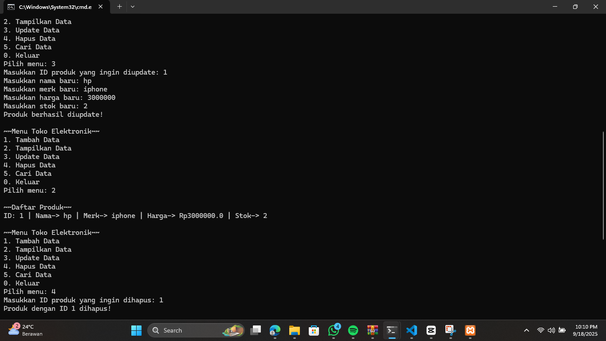
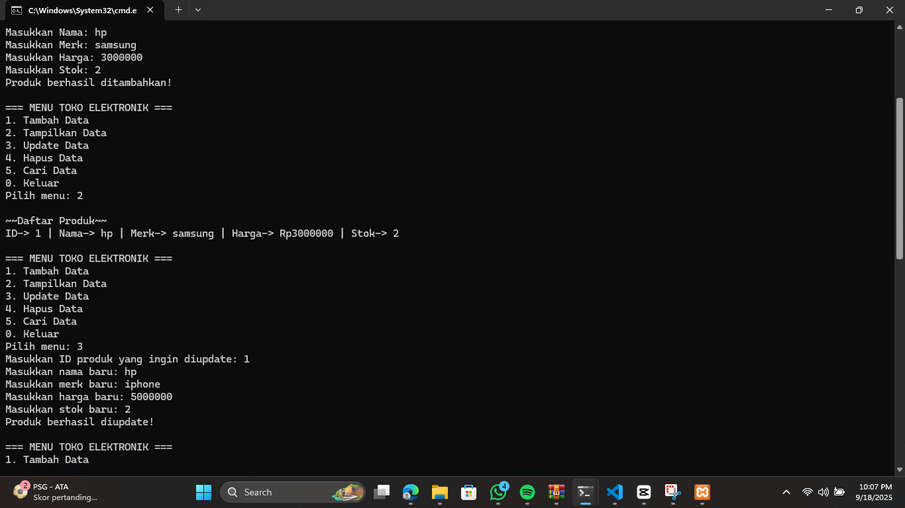

# TPDPBO2425C2
tugas praktikum 1

janji: Saya Nisrina Safinatunnajah dengan NIM 2410093 mengerjakan Tugas Praktikum 1 dalam mata kuliah DPBO untuk keberkahanNya maka saya tidak melakukan kecurangan seperti yang telah dispesifikasikan. Aamiin

penjelasan desain dan flow kode program: Program ini didesain untuk mengelola data produk elektronik menggunakan konsep CRUD (Create, Read, Update, Delete). Struktur utama program terdiri dari sebuah kelas bernama Produk yang menyimpan atribut produk seperti id, nama, merk, harga, dan stok. Kelas ini juga memiliki metode sederhana, misalnya getId() untuk mengambil nilai ID produk, serta tampilkan() untuk menampilkan detail produk ke layar.

Seluruh operasi utama dikelola melalui beberapa fungsi:

tambahData() digunakan untuk membuat objek produk baru dan menambahkannya ke array.
tampilData() menampilkan semua produk yang sudah tersimpan.
updateData() mencari produk berdasarkan ID, lalu mengganti datanya dengan input baru.
hapusData() mencari produk lalu menghapusnya dengan cara menggeser elemen setelahnya ke kiri.
cariData() digunakan untuk menemukan produk tertentu berdasarkan ID dan menampilkannya.
Alur utama program berjalan di dalam fungsi main(). Program menampilkan menu interaktif yang berisi pilihan tambah, tampilkan, update, hapus, cari, dan keluar. Menu ini dibungkus dalam sebuah perulangan sehingga program akan terus berjalan sampai pengguna memilih opsi keluar.

flow code: saat program dijalankan, menu utama muncul di layar. Pengguna lalu memilih opsi sesuai kebutuhan. Jika memilih tambah Data, program meminta pengguna memasukkan ID, nama, merk, harga, dan stok, lalu menyimpannya ke dalam array. Jika memilih tampilkan Data, seluruh isi array ditampilkan ke layar. Saat pengguna memilih update data atau hapus Data, program akan mencari produk berdasarkan ID. Jika ID ditemukan, data produk akan diperbarui atau dihapus sesuai perintah. Untuk cari data, program menampilkan detail produk yang sesuai dengan ID yang dimasukkan. Proses ini akan terus berulang hingga pengguna memilih opsi keluar, yang kemudian menghentikan program.

Dokumentasi cpp:

dokumentasi java:

dokumentasi php:

dokumentasi python:

